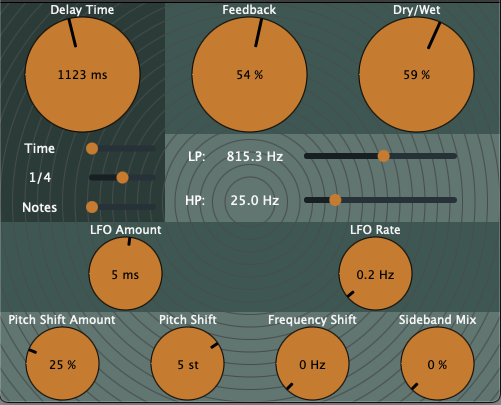

# Strange Artificial Echoes

**Strange Artificial Echoes** is a delay plugin based on the JUCE framework.

### Features:
- LFO modulation of delay time
- Pitch shifter based on Signalsmith Stretch library
- Bode-style frequency shifter

## Credits

- Pitch shifter - [Signalsmith Stretch: C++ pitch/time library](https://github.com/Signalsmith-Audio/signalsmith-stretch)
